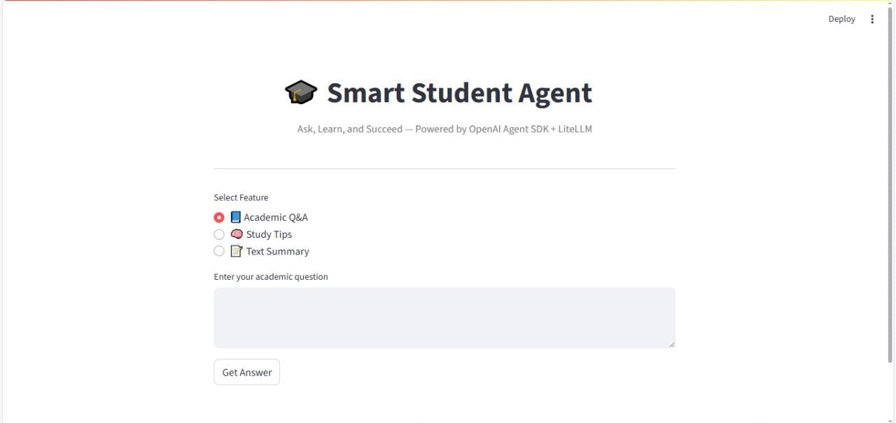

# 🎓 Smart Student Agent

An intelligent AI agent built using **Python + OpenAI Agent SDK** to assist students with learning, revising, and understanding academic content — quickly and clearly.

🔗 **Live Demo:** [Click here to try the Smart Student Agent](https://smart-student-agent.streamlit.app/)

---

## 💡 What It Does

Ask your academic question — get intelligent, simple, and fast answers.

✅ Answer subject-related questions  
✅ Provide effective study tips  
✅ Summarize small text passages  
✅ Friendly and interactive experience  

---

## ✨ Features

- 💻 Built with OpenAI Agent SDK
- 🌐 Powered by LiteLLM + OpenRouter (free model access)
- 🧠 Custom agent logic with clean responses
- 🖥️ Simple and responsive Streamlit UI

---

## 🖼️ Preview



---

## 📁 Folder Structure

```

📦 smart-student-agent
┣ 📄 app.py          → Frontend (Streamlit)
┣ 📄 main.py         → Core agent logic
┣ 📄 requirements.txt
┣ 📄 .env            → API key config (keep secret)

```

---

## 🧑‍💻 Ideal For

- Students doing assignments or revisions  
- Teachers demonstrating AI in education  
- Freelance developers showcasing AI agent skills  
- Clients seeking a smart academic assistant

---

## 🔐 Tech Stack

- Python 3.10+
- Streamlit
- OpenAI Agent SDK
- LiteLLM (with OpenRouter models)

---

## 📞 Contact

Need a customized version for your use case?

📧 Email: **muhammadwaheedairi@gmail.com**  
🐙 GitHub: [@muhammadwaheedairi](https://github.com/muhammadwaheedairi)

---

> Built with ❤️ to simplify learning through AI.